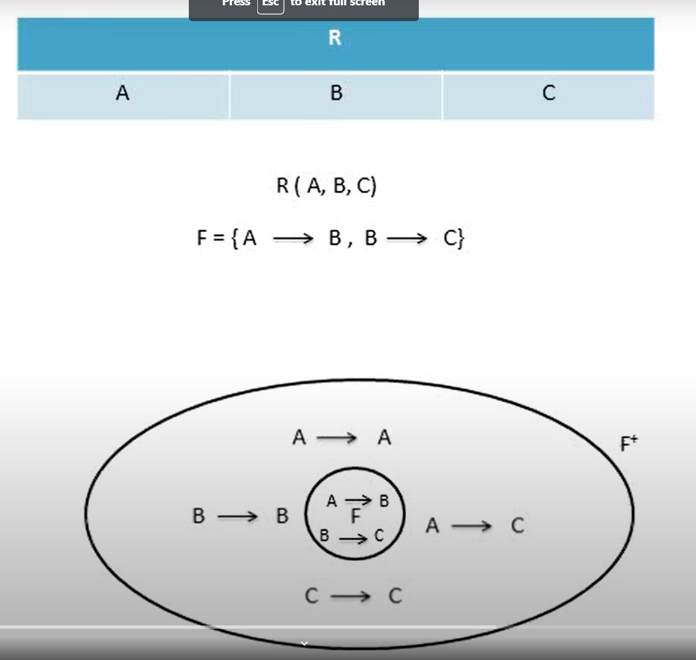
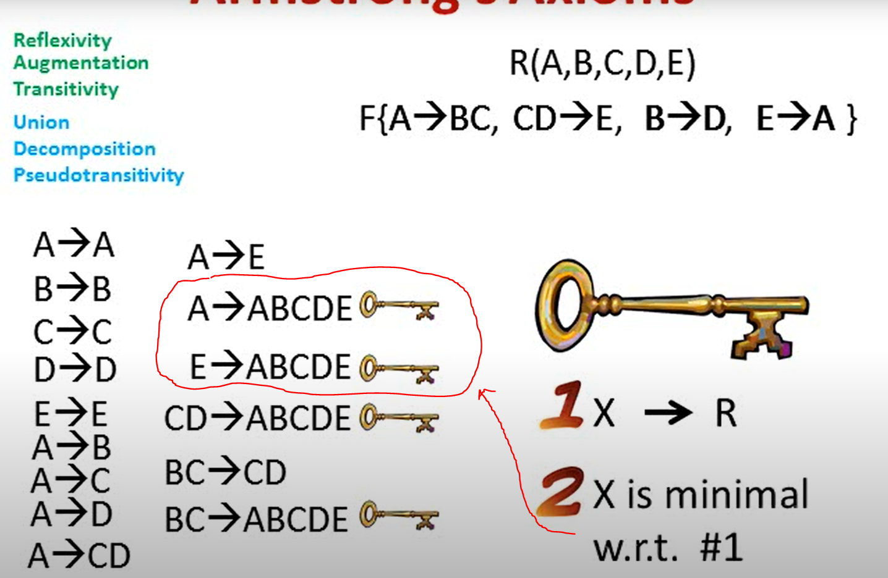

The exam will be comprehensive and will cover all of the chapters (Ch. 1, 6, 2, 3, 4, and 7) as well as the types of SQL queries we covered in the homework assignments. 
The exam will have around 7-10 questions, and the format and types of questions will be similar to those on the midterm exam.

* Standard SQL queries (for these types of queries, you're only allowed to use standard SQL syntax covered in class, and 5 standard aggregate functions, i.e., sum(), count(), avg(), max(), min()).
* Relational Expressions.
* Given an SQL query, convert it to a relational expression, and vice versa.
* Given an SQL query in one format, convert it to a different format (e.g., Nested Sub-Query to non-Nested Sub-Query, etc.).
* Questions about key concepts – as was the case on the midterm exam, I'm looking for answers "in your own words" (vs., taking answers from exercise questions, slides, etc.). For that reason, I expect everyone's answers to be "unique" (i.e., not resembling someone else's answers), but they also must be accurate and precise.

Some of the topics include (but are not limited to):
- Good tables vs. bad tables
- Design process
- BCNF
- 3NF
- LLJD (Lossless Join Decomposition)
- Dependency Preservation
- Various types of keys: Super keys, Candidate keys, Primary keys, Foreign keys
- Decomposition
- Armstrong’s Axioms + additional axioms derived from Armstrong's Axioms (including proofs, as in the exercise questions)
- Functional Dependencies
- Closure of Attribute Sets
- Set vs. Multi-Set
- Entity sets, Relationship sets
- Relation, Domain, Atomic Domain
- Cartesian Product vs. Joins
- Various Join types
- Derived Relations/Tables
- WITH, VIEWS
- Nested Sub-Queries
- DDL (e.g., domain constraints, check clause, referential integrity)

# Good tables vs. bad tables
A non-exhaustive list. For all these questions, yes is a good answer and no is bad.

* Does the table serve a clear business function? 
* How well does it fit the application's purpose?
* Is the table well-named? 
* Are the table's columns well-named? 
* Would a business user understand what they mean?
* Does the table have a primary key?
* Does the table have unique constraints on all the business (candidate) keys?
* Are all the foreign keys defined?
* Do all the columns with constrained values have a foreign key to a reference data table or a check constraint (or an enum for MySQL)?
* Do all the columns have the correct (strongest) data type?
* Is the table correctly normalised? (In an OLTP environment that means at least Boyce-Codd Normal Form, things are different in data warehouses.)
* Is the table free of any columns which hold "smart keys", CSV strings, JSON, XML, different data items whose meaning is dependent on metadata held in another column (or another table), or any other exotic structure which seemed like a good idea at the time but which will incur a legacy of horrible code and data corruption for years after?
* Are all the columns scalar, using recognised Oracle built-in data types (i.e. no nested tables or user-defined types)?
* Does the Physical Data Model diagram include the table?
* Is the table derivable from entities in the Logical Data Model diagram?
* Do you have scripts of the DDL for the table and its dependent objects? Are those scripts in source control?
* Does the table conform to whatever modelling and coding standards you have (if any)?
* Is the table physically implemented properly (e.g. all necessary indexes, index-organized if appropriate, partitioning if appropriate)?
* Is the table defensible? How comfortable would you be explaining it to another experienced data modeller, database developer or business user?

[src](https://stackoverflow.com/questions/50264281/how-to-evaluate-whether-a-tables-good-or-bad-in-a-database-system)

# Overall Database Design Process Overall Database Design Process

* We have assumed schema R is given
    * R could have been generated when converting E-R diagram to a set of tables.
    * R could have been a single relation containing all attributes that are of interest (called universal relation).
    * Normalization breaks R into smaller relations.
    * R could have been the result of some ad hoc design of relations, which we then test/convert to normal form.

[src](Chapter 7 Relational Database Design.pdf)

# BCNF

**Boyce–Codd normal form** (or BCNF or 3.5NF) is a normal form used in database normalization. It is a slightly stronger version of the **third normal form (3NF)**. BCNF was developed in 1974 by Raymond F. Boyce and Edgar F. Codd to address certain types of anomalies not dealt with by 3NF as originally defined.

If a relational schema is in BCNF then all redundancy based on functional dependency has been removed, although other types of redundancy may still exist. A relational schema R is in Boyce–Codd normal form if and only if for every one of its dependencies X → Y, at least one of the following conditions hold:
- X → Y is a trivial functional dependency (Y ⊆ X),
- X is a superkey for schema R.

[src](https://en.wikipedia.org/wiki/Boyce%E2%80%93Codd_normal_form)

# 3NF

Third normal form (3NF) is a database schema design approach for relational databases which uses normalizing principles to reduce the duplication of data, avoid data anomalies, ensure referential integrity, and simplify data management. It was defined in 1971 by Edgar F. Codd, an English computer scientist who invented the relational model for database management.

A database relation (e.g. a database table) is said to meet third normal form standards if all the attributes (e.g. database columns) are functionally dependent on solely the primary key. Codd defined this as a relation in second normal form where all non-prime attributes depend only on the candidate keys and do not have a transitive dependency on another key.

# LLJD (Lossless Join Decomposition)

In database design, a lossless join decomposition is a decomposition of a relation *R* into relations *R1, R2* such that a natural join of the two smaller relations yields back the original relation. This is central in removing redundancy safely from databases while preserving the original data.

[src](https://en.wikipedia.org/wiki/Lossless_join_decomposition)

# Dependency Preservation
- It is an important constraint of the database.
- In the dependency preservation, at least one decomposed table must satisfy every dependency.
- If a relation R is decomposed into relation R1 and R2, then the dependencies of R either must be a part of R1 or R2 or must be derivable from the combination of functional dependencies of R1 and R2.
- For example, suppose there is a relation R (A, B, C, D) with functional dependency set (A->BC). The relational R is decomposed into R1(ABC) and R2(AD) which is dependency preserving because FD A->BC is a part of relation R1(ABC).

[src](https://www.javatpoint.com/dbms-relational-decomposition)

# Various types of keys: Super keys, Candidate keys, Primary keys, Foreign keys

In the relational data model a <b>superkey</b> is a set of attributes that uniquely identifies each tuple of a relation Because superkey values are unique, tuples with the same superkey value must also have the same non-key attribute values. That is, non-key attributes are functionally dependent on the superkey.

The set of all attributes is always a superkey (the trivial superkey). Tuples in a relation are by definition unique, with duplicates removed after each operation, so the set of all attributes is always uniquely valued for every tuple. A <b>candidate key (or minimal superkey)</b> is a superkey that can't be reduced to a simpler superkey by removing an attribute

### example

For example, in an employee schema with attributes employeeID, name, job, and departmentID, if employeeID values are unique then employeeID combined with any or all of the other attributes can uniquely identify tuples in the table. Each combination, {employeeID}, {employeeID, name}, {employeeID, name, job}, and so on is a superkey. {employeeID} is a candidate key--no subset of its attributes is also a superkey. {employeeID, name, job, departmentID} is the trivial superkey.

# Armstrong’s Axioms + additional axioms derived from Armstrong's Axioms (including proofs, as in the exercise questions)

## Reflexivity

 If X is a set of attributes and Y is a subset of X, then X -->(functionally determines) Y

## Augmentation

 If X --> Y and Z is a set of attributes, then XZ --> YZ. 

## Transitivity

 If X --> Y and Y --> Z, then X --> Z

### Additional rules (derived from primary axioms)

## Decomposition

 If X --> YZ then X -- Y and X --> Z

### proof
1. X --> YZ (GIVEN)
2. YZ --> Y (Reflexivity)
3. X --> Y (Transitivity)

## Composition

If X --> Y and A --> B then XA --> YB

## Union

If X --> Y and X --> Z then X --> YZ

## Pseudo transitivity

If X --> Y and YZ --> W then XZ --> W

## Self determination

I --> I for any I

## Example: 

### Creating F and F+ (Set of functional dependencies)

### Finding Candidate Key

# Functional Dependencies

 In relational database theory, a functional dependency is a constraint between two sets of attributes in a relation from a database. In other words, a functional dependency is a constraint between two attributes in a relation. Given a relation R and sets of attributes {\displaystyle X,Y\subseteq R}{\displaystyle X,Y\subseteq R}, X is said to functionally determine Y (written X → Y) if and only if each X value in R is associated with precisely one Y value in R; R is then said to satisfy the functional dependency X → Y. 

# Closure of Attribute Sets

# Closure of attribute sets
The closure of a set of attributes X is the set of those attributes that can be functionally determined from X. The closure of X is denoted as X+.

# Set vs. Multi-Set
In mathematics, a multiset is a modification of the concept of a set that, unlike a set, allows for multiple instances for each of its elements

# Entity sets, Relationship sets

An <b>entity set</b> is a group of similar entities and these entities can have attributes. In terms of DBMS, an entity is a table or attribute of a table in database, so by showing relationship among tables and their attributes, ER diagram shows the complete logical structure of a database.

A <b>relationship set</b> is a set of relationships of the same type. Formally it is a mathematical relation on (possibly non-distinct) sets

# Relation
In relational database theory, a relation, is a set of tuples (d1, d2, ..., dn),

# Domain
Type or data type

# Atomic Domain
A domain is the original sets of atomic values used to model data. By atomic value, we mean that each value in the domain is indivisible as far as the relational model is concerned. For example: The domain of Marital Status has a set of possibilities: Married, Single, Divorced

# Cartesian Product vs. Joins

SQL specifies five types of JOIN: INNER, LEFT OUTER, RIGHT OUTER, FULL OUTER and CROSS.